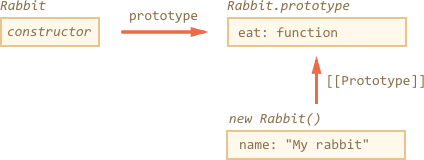

# Class patterns

```quote author="Wikipedia"
In object-oriented programming, a *class* is an extensible program-code-template for creating objects, providing initial values for state (member variables) and implementations of behavior (member functions or methods).
```

There's a special syntax construct and a keyword `class` in JavaScript. But before studying it, we should consider that the term "class" comes the theory of object-oriented programming. The definition is cited above, and it's language-independant.

In JavaScript there are several well-known programming patterns to make classes even without using the `class` keyword. And here we'll talk about them first.

The `class` construct will be described in the next chapter, but in Javascript it's a "syntax sugar" and an extension of one of the patterns that we'll study here.

[cut]


## Functional class pattern

The constructor function below can be considered a class according to the definition:

```js run
function User(name) {
  this.sayHi = function() {
    alert(name;
  };
}

let user = new User("John");
user.sayHi(); // John
```

It follows all parts of the definition:

1. It is a "program-code-template" for creating objects (callable with `new`).
2. It provides initial values for the state (`name` from parameters).
3. It provides methods (`sayHi`).

This is called *functional class pattern*.

In the functional class pattern, local variables and nested functions inside `User`, that are not assigned to `this`, are visible from inside, but not accessible by the outer code.

So we can easily add internal functions and variables, like `calcAge()` here:

```js run
function User(name, birthday) {

*!*
  // only visible from other methods inside User
  function calcAge() {
    new Date().getFullYear() - birthday.getFullYear();
  }
*/!*

  this.sayHi = function() {
    alert(name + ', age:' + calcAge());
  };
}

let user = new User("John", new Date(2000,0,1));
user.sayHi(); // John
```

In this code variables `name`, `birthday` and the function `calcAge()` are internal, *private* to the object. They are only visible from inside of it. The external code that creates the `user` only can see a *public* method `sayHi`.

In works, because functional classes provide a shared lexical environment (of `User`) for private variables and methods.

## Prototype-based classes

Functional class pattern is rarely used, because prototypes are generally better.

Soon you'll see why.

Here's the same class rewritten using prototypes:

```js run
function User(name, birthday) {
*!*
  this._name = name;
  this._birthday = birthday;
*/!*
}

*!*
User.prototype._calcAge = function() {
*/!*
  return new Date().getFullYear() - this._birthday.getFullYear();
};

User.prototype.sayHi = function() {
  alert(this._name + ', age:' + this._calcAge());
};

let user = new User("John", new Date(2000,0,1));
user.sayHi(); // John
```

- The constructor `User` only initializes the current object state.
- Methods reside in `User.prototype`.

Here methods are technically not inside `function User`, so they do not share a common lexical environment.

So, there is a widely known agreement that internal properties and methods are prepended with an underscore `"_"`. Like `_name` or `_calcAge()`. Technically, that's just an agreement, the outer code still can access them. But most developers recognize the meaning of `"_"` and try not to touch prefixed properties and methods in the external code.

We already can see benefits over the functional pattern:

- In the functional pattern, each object has its own copy of methods like `this.sayHi = function() {...}`.
- In the prototypal pattern, there's a common `User.prototype` shared between all user objects.

So the prototypal pattern is more memory-efficient.

...But not only that. Prototypes allow us to setup the inheritance, precisely the same way as built-in Javascript constructors do. Functional pattern allows to wrap a function into another function, and kind-of emulate inheritance this way, but that's far less effective, so here we won't go into details to save our time.

## Prototype-based inheritance for classes

Let's say we have two prototype-based classes.

`Rabbit`:

```js
function Rabbit(name) {
  this.name = name;
}

Rabbit.prototype.jump = function() {
  alert(this.name + ' jumps!');
};

let rabbit = new Rabbit("My rabbit");
```



...And `Animal`:

```js
function Animal(name) {
  this.name = name;
}

Animal.prototype.eat = function() {
  alert(this.name + ' eats.');
};

let animal = new Animal("My animal");
```


Right now they are fully independent.

But naturally `Rabbit` is a "subtype" of `Animal`. In other words, rabbits should be based on animals, have access to methods of `Animal` and extend them with its own methods.

What does it mean in the language on prototypes?

Right now `rabbit` objects have access to `Rabbit.prototype`. We should add `Animal.prototype` to it. So the chain would be `rabbit -> Rabbit.prototype -> Animal.prototype`.

Like this:


The code example:

```js run
// Same Animal as before
function Animal(name) {
  this.name = name;
}

// All animals can eat, right?
Animal.prototype.eat = function() {
  alert(this.name + ' eats.');
};

// Same Rabbit as before
function Rabbit(name) {
  this.name = name;
}

Rabbit.prototype.jump = function() {
  alert(this.name + ' jumps!');
};

*!*
// setup the inheritance chain
Rabbit.prototype.__proto__ = Animal.prototype; // (*)
*/!*

let rabbit = new Rabbit("White Rabbit");
*!*
rabbit.eat(); // rabbits can eat too
*/!*
rabbit.jump();
```

The line `(*)` sets up the prototype chain. So that `rabbit` first searches methods in `Rabbit.prototype`, then `Animal.prototype`. And then, just for completeness, the search may continue in `Object.prototype`, because `Animal.prototype` is a regular plain object, so it inherits from it. But that's not painted for brevity.

Here's what the code does:


## Summary

The term "class" comes from the object-oriented programming. In Javascript it usually means the functional class pattern or the prototypal pattern. The prototypal pattern is more powerful and memory-efficient, so it's recommended to stick to it.

According to the prototypal pattern:
1. Methods are stored in `Class.prototype`.
2. Prototypes inherit from each other.

In the next chapter we'll study `class` keyword and construct. It allows to write prototypal classes shorter and provides some additional benefits.
