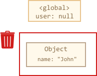
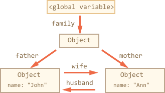
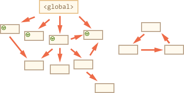

# Garbage collection

Memory management in Javascript is performed automatically and invisibly to us. We create primitives, objects, functions... All that takes memory.

What happens when something is not needed any more? How Javascript engine discovers that and cleans up?

[cut]

## Reachability

The main concept of memory management in Javascript is *reachability*. 

Simply put, "reachable" values are those that are accessible now or in the future. They are guaranteed to be stored in memory.

1. There's a base set of inherently reachable values. For instance:

    - Local variables and parameters of the current function.
    - Variables and parameters for other functions on the current chain of nested calls.
    - Global variables.
    - (there are some other, internal ones as well)

    These values are called *roots*. 

2. Any other value is retained in memory only while it's reachable from a root by a reference of by a chain of references.

There's a background process that runs by the engine itself called [garbage collector](https://en.wikipedia.org/wiki/Garbage_collection_(computer_science)). It monitors all objects and removes those that became unreachable.

## A simple example

Here's the simplest example:

```js
// user has a reference to the object
let user = {
  name: "John"
};
```


Here an on further pictures, arrows depict references. For instance, the global variable `"user"` references John (the object `{name: "John"}`). The `"name"` property is not a reference, it stores a primitive, so it's painted inside the object.

If the `user` is overwritten, the reference is lost:

```js
user = null;
```



Now John becomes unreachable. There's no way to access it, no references to it. Garbage collector will junk the data and free the memory.

## Two references

Now let's imagine we copied the reference from `user` to `admin`:

```js
// user has a reference to the object
let user = {
  name: "John"
};

*!*
let admin = user;
*/!*
```


Now if we do the same:
```js 
user = null;
```

...Then the object is still reachable via `admin` global variable, so it's in memory. If we overwrite `admin` too, then it can be removed.

## Interlinked objects

Now a more complex example. The family:

```js
function marry(man, woman) {
  woman.husband = man;
  man.wife = woman;

  return {
    father: man,
    mother: woman
  }
}

let family = marry({
  name: "John"
}, {
  name: "Ann"
});
```

Function `marry` "marries" two objects by giving them references to each other and returns a new object that contains them both.

The resulting memory structure:



To activate garbage collection, let's remove two references:

```js
delete family.father;
delete family.mother.husband;
```

Note that if the deletion of any single one of them would not lead to anything, because all objects would still be reachable.

But if we delete both, then we can see that John has no incoming references any more:


Outgoing references do not matter. Only incoming ones can make an object reachable.

John, the former `family.father` is now unreachable and will be removed from the memory with all its data that also became unaccessible.

After garbage collection:


## Unreachable island

It is possible that the whole island of interlinked objects becomes unreachable and is removed from the memory.

The source object is the same as above. Then:

```js
family = null;
```

The result:


This example demonstrates how important the concept of reachability is.

It is clearly seen that John and Ann are still linked, both have incoming references. But it's not enough. 

The former `"family"` object has been unlinked from the root, there's no reference to it any more, so the whole island became unreachable and will be removed.

## Internal algorithms

The basic garbage collection algorithm is called "mark-and-sweep".

Regularly the following "garbage collection" steps are performed:

- The garbage collector takes roots and "marks" them.
- Then it visits and "marks" all references from them.
- Then it visits marked objects and marks *their* references, but the same object is not visited twice.
- ...And so on until there are unvisited references (reachable from the roots).
- All objects except marked ones are removed.

For instance, if our object structure looks like this:


Then the first step marks the roots:



Then their references are marked:


...And their refences, while possible:


Now the objects that could not be visited in the process are considered unreachable and will be removed:


That's the concept how garbage collection works.

Javascript engines apply many optimizations to it, to make it run faster and be more hidden behind the scenes. 

Some of the optimizations:

- **Generational collection** -- objects are split into two sets: "new ones" and "old ones". Many objects appear, do their job and die fast, so they can be cleaned up more aggressively. Those "new" that survive for long enough, become "old". 
- **Incremental collection** -- if there are many objects, and we try to walk and mark the whole object set at once, it may take some time and introduce visible delays. So the engine tries to split the job into pieces. Then pieces are executed one at a time. That requires some extra bookkeeping in-between them to stay consistent.
- **Idle-time collection** -- the garbage collector tries to run only while the CPU is idle, to reduce the possible effect on the execution.

In-depth understanding of these optimization is also possible, there's no magic, but it requires a lot of under-the-hood digging. Javascript engines implement garbage collection differently. And -- what's even more important, things change, so going really deep "in advance" is probably not worth that. Unless, of course, it is a matter of pure interest. 

## Summary

The main things to know:

- Garbage collection is performed automatically. We cannot force or prevent it.
- Objects are retained in memory while they are reachable.
- Being referenced is not the same as being reachable (from a root): a pack of interlinked objects can become unreachable as a whole.

Modern engines implement advanced algorithms of garbage collection.

If you are familiar with low-level programming, the more detailed information about V8 garbage collector is in the article [A tour of V8: Garbage Collection](http://jayconrod.com/posts/55/a-tour-of-v8-garbage-collection). Also you'd better prepare yourself by learning how values are stored in V8. I'm saying: "V8", because it is best covered with articles in the internet. For other engines, things are somewhat similar, but not the same.

In-depth knowledge of engines is good when you need low-level optimizations. It would be wise to plan that as the next step after you're familiar with the language.  


