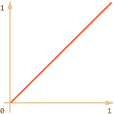
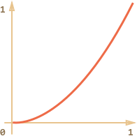
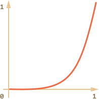
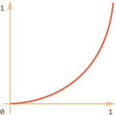
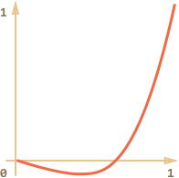
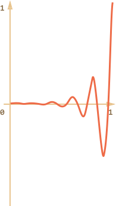
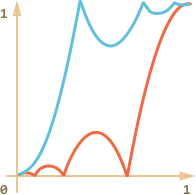
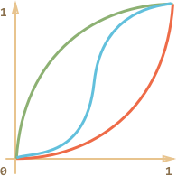

# JavaScript animations [todo]

JavaScript animations can handle things that CSS can't.

For instance, moving along a complex path, with a timing function different from Bezier curves, or an animation on a canvas.

[cut]

## setInterval

From the HTML/CSS point of view, an animation is a gradual change of the style property. For instance, changing `style.left` from `0px` to `100px` moves the element.

And if we increase it in `setInterval`, by making 50 small changes per second, then it looks smooth. That's the same principle as in the cinema: 24 or more frames per second is enough to make it look smooth.

The pseudo-code can look like this:

```js
let fps = 50; // 50 frames per second
let timer = setInterval(function() {
  if (animation complete) clearInterval(timer);
  else increase style.left
}, 1000 / fps)
```

The more complete example of the animation:
Более полный пример кода анимации:

```js
let start = Date.now(); // remember start time

let timer = setInterval(function() {
  // how much time passed from the start?
  let timePassed = Date.now() - start;

  if (timePassed >= 2000) {
    clearInterval(timer); // finish the animation after 2 seconds
    return;
  }

  // draw the animation at the moment timePassed
  draw(timePassed);

}, 20);

// as timePassed goes from 0 to 2000
// left gets values from 0px to 400px
function draw(timePassed) {
  train.style.left = timePassed / 5 + 'px';
}
```

Click for the demo:

[codetabs height=200 src="move"]

## requestAnimationFrame

Let's imagine we have several simultaneous animations.

If we run them separately, each one with its own `setInterval(..., 20)`, then the browser would have to repaint much more often than every `20ms`.

Each `setInterval` triggers once per `20ms`, but they are independent, so we have several independent runs within `20ms`.

These several independant actions should be grouped together, because it's easier for the browser to redraw things once per `20ms`.

In other words, this:

```js
setInterval(function() {
  animate1();
  animate2();
  animate3();
}, 20)
```

...Is lighter than this:

```js
setInterval(animate1, 20);
setInterval(animate2, 20);
setInterval(animate3, 20);
```

There's one more thing to keep in mind. Sometimes when CPU is overloaded or for other reasons it may be better to trigger redraws less often. Not 20, but maybe 200ms.

There's a standard [Animation timing](http://www.w3.org/TR/animation-timing/) that provides the function `requestAnimationFrame`.

It addresses all those issues and even more.

The syntax:
```js
let requestId = requestAnimationFrame(callback)
```

That schedules the `callback` function to run in the closest time when the browser wants to do animation.

If we do changes in elements in `callback` then they will be grouped together with other `requestAnimationFrame` callbacks and with CSS animations. So there will be one repaint instead of many.

The returned value `requestId` can be used to cancel the call:
```js
// cancel the scheduled execution of callback
cancelAnimationFrame(requestId);
```

The `callback` function получает один аргумент -- время, прошедшее с начала загрузки страницы, результат вызова [performance.now()](https://developer.mozilla.org/en-US/docs/Web/API/Performance/now).

Как правило, запуск `callback` происходит очень скоро. Если у процессора большая загрузка или батарея у ноутбука почти разряжена -- то пореже.

Если вы запустите этот код, то увидите промежутки между первыми 20 запусками `requestAnimationFrame`. Как правило, это 10-20 мс, но бывает и больше и меньше. Это оптимальная частота анимации с точки зрения браузера.

```html run height=40 refresh
<script>
  let prev = performance.now();
  let times = 0;

  requestAnimationFrame(function measure(time) {
    document.body.insertAdjacentHTML("beforeEnd", Math.floor(time - prev) + " ");
    prev = time;

    if (times++ < 10) requestAnimationFrame(measure);
  })
</script>
```

Функция анимации на основе `requestAnimationFrame`:

```js
// Рисует функция draw
// Продолжительность анимации duration
function animate(draw, duration) {
  let start = performance.now();

  requestAnimationFrame(function animate(time) {
    // определить, сколько прошло времени с начала анимации
    let timePassed = time - start;

    // возможно небольшое превышение времени, в этом случае зафиксировать конец
    if (timePassed > duration) timePassed = duration;

    // нарисовать состояние анимации в момент timePassed
    draw(timePassed);

    // если время анимации не закончилось - запланировать ещё кадр
    if (timePassed < duration) {
      requestAnimationFrame(animate);
    }

  });
}
```

Использование для поезда:
```js
animate(function(timePassed) {
  train.style.left = timePassed / 5 + 'px';
}, 2000);
```

В действии:

[codetabs src="move-raf"]

## Структура анимации

На основе `requestAnimationFrame` можно соорудить и гораздо более мощную, но в то же время простую функцию анимации.

У анимации есть три основных параметра:

`duration`
: Общее время, которое должна длиться анимация, в мс. Например, `1000`.

`timing(timeFraction)`
: Временная функция, которая, по аналогии с CSS-свойством `transition-timing-function`, будет по текущему времени вычислять состояние анимации.

    Она получает на вход непрерывно возрастающее число `timeFraction` -- от `0` до `1`, где `0` означает самое начало анимации, а `1` -- её конец.

    Её результатом должно быть значение завершённости анимации, которому в CSS transitions на кривых Безье соответствует координата `y`.

    Также по аналогии с `transition-timing-function` должны соблюдаться условия:

- timing(0) = 0
- timing(1) = 1

    ...То есть, анимация начинается в точке `(0,0)` -- нулевое время и нулевой прогресс и заканчивается в `(1, 1)` -- прошло полное время, и процесс завершён.

    Например, функция-прямая означает равномерное развитие процесса:
    ```js
    function linear(timeFraction) {
      return timeFraction;
    }
    ```

    Её график:


    Как видно, её график полностью совпадает с `transition-timing-function: linear`, и эффект абсолютно такой же.

    Есть и другие, более интересные варианты, мы рассмотрим их чуть позже.

`draw(progress)`
: Функция, которая получает состояние завершённости анимации и рисует его. Значению `progress=0` соответствует начальная точка анимации, `progress=1` -- конечная.

    Именно эта функция и осуществляет, собственно, анимацию.

    Например, может двигать элемент:
    ```js
    function draw(progress) {
      train.style.left = progress + 'px';
    }
    ```

    Возможны любые варианты, анимировать можно что угодно и как угодно.

Анимируем ширину элемента `width` от `0` до `100%`, используя нашу функцию.

Кликните для демонстрации:

[codetabs height=60 src="width"]

Код для запуска анимации:

```js
animate({
  duration: 1000,
  timing: function(timeFraction) {
    return timeFraction;
  },
  draw: function(progress) {
    elem.style.width = progress * 100 + '%';
  }
});
```

## Временные функции

Выше мы видели самую простую, линейную временную функцию.

Рассмотрим примеры анимации движения с использованием различных `timing`.

### В степени n

Вот еще один простой случай -- `progress` в степени `n`. Частные случаи - квадратичная, кубическая функции и т.д.

Для квадратичной функции:

```js
function quad(progress) {
  return Math.pow(progress, 2)
}
```

**График квадратичной функции:**



Пример для квадратичной функции (клик для просмотра):

[iframe height=40 src="quad" link]

Увеличение степени влияет на ускорение. Например, график для 5-й степени:



В действии:

[iframe height=40 src="quint" link]

### Дуга

Функция:

```js
function circ(timeFraction) {
  return 1 - Math.sin(Math.acos(timeFraction))
}
```

**График:**



[iframe height=40 src="circ" link]

### Back: стреляем из лука

Эта функция работает по принципу лука: сначала мы "натягиваем тетиву", а затем "стреляем".

В отличие от предыдущих функций, эта зависит от дополнительного параметра `x`, который является "коэффициентом упругости". Он определяет расстояние, на которое "оттягивается тетива".

Её код:

```js
function back(x, timeFraction) {
  return Math.pow(timeFraction, 2) * ((x + 1) * timeFraction - x)
}
```

**График для `x = 1.5`:**



Пример для `x = 1.5`:

[iframe height=40 src="back" link]

### Отскок bounce

Представьте, что мы отпускаем мяч, он падает на пол, несколько раз отскакивает и останавливается.

Функция `bounce` делает то же самое, только наоборот: "подпрыгивание" начинается сразу.

Эта функция немного сложнее предыдущих и использует специальные коэффициенты:

```js
function bounce(timeFraction) {
  for (let a = 0, b = 1, result; 1; a += b, b /= 2) {
    if (timeFraction >= (7 - 4 * a) / 11) {
      return -Math.pow((11 - 6 * a - 11 * timeFraction) / 4, 2) + Math.pow(b, 2)
    }
  }
}
```

Код взят из MooTools.FX.Transitions. Конечно же, есть и другие реализации `bounce`.

Пример:

[iframe height=40 src="bounce" link]

### Упругая анимация

Эта функция зависит от дополнительного параметра `x`, который определяет начальный диапазон.

```js
function elastic(x, timeFraction) {
  return Math.pow(2, 10 * (timeFraction - 1)) * Math.cos(20 * Math.PI * x / 3 * timeFraction)
}
```

**График для `x=1.5`:**


Пример для `x=1.5`:

[iframe height=40 src="elastic" link]

## Реверсивные функции ease*

Итак, у нас есть коллекция временных функций.

Их прямое использование называется "easeIn".

**Иногда нужно показать анимацию в обратном режиме. Преобразование функции, которое даёт такой эффект, называется "easeOut"**.

### easeOut

В режиме "easeOut", значение timing вычисляется по формуле: `timingEaseOut(timeFraction) = 1 - timing(1 - timeFraction)`

Например, функция `bounce` в режиме "easeOut":

```js
// обычный вариант
function bounce(timeFraction) {
  for (let a = 0, b = 1, result; 1; a += b, b /= 2) {
    if (timeFraction >= (7 - 4 * a) / 11) {
      return -Math.pow((11 - 6 * a - 11 * timeFraction) / 4, 2) + Math.pow(b, 2);
    }
  }
}

// преобразователь в easeOut
function makeEaseOut(timing) {
  return function(timeFraction) {
    return 1 - timing(1 - timeFraction);
  }
}

*!*
let bounceEaseOut = makeEaseOut(bounce);
*/!*
```

Полный пример -- отскок в `bounceEaseOut` теперь не в начале, а в конце (и это куда красивее):

[codetabs src="bounce-easeout"]

На этом графике видно, как преобразование `easeOut` изменяет поведение функции:



Если есть анимационный эффект, такой как подпрыгивание -- он будет показан в конце, а не в начале (или наоборот, в начале, а не в конце).

Красным цветом обозначен <span style="color:#EE6B47">обычный вариант</span>, а <span style="color:#62C0DC">синим</span> -- `easeOut`.

- Обычно анимируемый объект сначала медленно скачет внизу, а затем, в конце, резко достигает верха..
- А после `easeOut` -- он сначала прыгает наверх, а затем медленно скачет внизу.

### easeInOut

А еще можно сделать так, чтобы показать эффект *и в начале и в конце* анимации. Соответствующее преобразование называется "easeInOut".

Его код выглядит так:

```js
if (timeFraction <= 0.5) { // первая половина анимации)
  return timing(2 * timeFraction) / 2;
} else { // вторая половина
  return (2 - timing(2 * (1 - timeFraction))) / 2;
}
```

Код, который трансформирует `timing`:

```js
function makeEaseInOut(timing) {
  return function(timeFraction) {
    if (timeFraction < .5)
      return timing(2 * timeFraction) / 2;
    else
      return (2 - timing(2 * (1 - timeFraction))) / 2;
  }
}

bounceEaseInOut = makeEaseInOut(bounce);
```

Пример с `bounceEaseInOut`:

[codetabs src="bounce-easeinout"]

Трансформация "easeInOut" объединяет в себе два графика в один: `easeIn` для первой половины анимации и `easeOut` -- для второй.

Это отлично видно, если посмотреть графики `easeIn`, `easeOut` и `easeInOut` на примере функции `circ`:



- <span style="color:#EE6B47">Красным</span> цветом обозначен обычный вариант функции `circ`.
- <span style="color:#8DB173">Зелёным</span> -- `easeOut`.
- <span style="color:#62C0DC">Синим</span> -- `easeInOut`.

Как видно, график первой половины анимации представляет собой уменьшенный "easeIn", а второй -- уменьшенный "easeOut". В результате, анимация начинается и заканчивается одинаковым эффектом.

```summary
Процесс анимации полностью в ваших руках благодаря `timing`. Её можно сделать настолько реалистичной, насколько захочется.

Впрочем, исходя из практики, можно сказать, что варианты `timing`, описанные выше, покрывают 95% потребностей в анимации.
```

## Сложные варианты step

Анимировать можно все, что угодно. Вместо движения, как во всех предыдущих примерах, можно изменять любые CSS свойства... И не только!

Достаточно лишь написать соответствующий `draw`.

### Набор текста

Можно, к примеру, анимировать набор текста в "скачущем" режиме:

[codetabs src="text"]

## Итого

Анимация выполняется путём вызовов `requestAnimationFrame`. Для поддержки IE9- желательно подключить полифилл, который будет внутри использовать `setTimeout`. Это будет всё равно лучше, чем независимые `setInterval`.

Реализация анимации -- очень простая и вместе с тем гибкая:

```js
function animate(options) {

  let start = performance.now();

  requestAnimationFrame(function animate(time) {
    // timeFraction от 0 до 1
    let timeFraction = (time - start) / options.duration;
    if (timeFraction > 1) timeFraction = 1;

    // текущее состояние анимации
    let progress = options.timing(timeFraction)

    options.draw(progress);

    if (timeFraction < 1) {
      requestAnimationFrame(animate);
    }

  });
}
```

Основные параметры:

- `duration` -- длительность анимации в мс.
- `timing` -- функция, которая определяет состояние анимации каждый кадр. Получает часть времени от 0 до 1, возвращает завершенность анимации от 0 до 1.
- `draw` -- функция, которая отрисовывает состояние анимации от 0 до 1.

Эту функцию можно улучшить, например добавить коллбэк `complete` для вызова в конце анимации.

Мы рассмотрели ряд примеров для `timing` и  трансформации `easeOut`, `easeInOut`, которые позволяют их разнообразить. В отличие от CSS мы не ограничены кривыми Безье, можно реализовать всё, что угодно.

Это же относится и к функции `draw`.

Такая реализация анимации имеет три основных области применения:

- Нестандартные задачи и требования, не укладывающиеся в рамки CSS.
- Поддержка IE9-.
- Графика, рисование на canvas.
