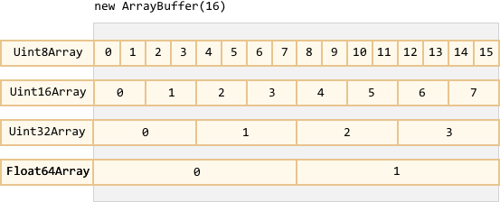

# Binary data

There's a lot of terms in Javascript, related to binary data: files, images and so on.

To name a few:
- `ArrayBuffer`, `Uint8Array`, `BufferSource`, `DataView`, `Blob`.

There are many questions how to convert one thing into another, because people just don't spare a minute to understand.

It may seem complex, but in fact it's not. Everything's fairly simple.

Let's sort things out.

**The basic binary entity is `ArrayBuffer` -- a fixed-length raw sequence of bytes.**

We create it like this:
```js run
let buffer = new ArrayBuffer(16); // create a buffer of length 16
alert(buffer.byteLength); // 16
```

This allocates a contiguous memory area of 16 bytes and pre-fills it with zeroes.

```warn header="`ArrayBuffer` is not `Array` at all"
Please note: technically `ArrayBuffer` has nothing in common with `Array`:
- It has a fixed length, we can't increase or decrease it.
- It takes exactly that much space in the memory.
- It can only store bytes, the exact number of them.
```

**To manipulate an `ArrayBuffer`, we need to use a "view" object.**

A view object does not store anything on it's own. It's just an "eyeglasses" that give different representation of the bytes.

For instance:

- **`Uint8Array`** -- treats each byte as a separate number, with possible values are from 0 to 255 (a byte is 8-bit, so can hold only that much). That's called a "8-bit unsigned integer".
- **`Uint16Array`** -- treats every 2 bytes as an integer, with possible values from 0 to 65535. That's called a "16-bit unsigned integer".
- **`Uint32Array`** -- treats every 4 bytes as an integer, with possible values from 0 to 4294967295. That's called a "32-bit unsigned integer".
- **`Float64Array`** -- treats every 8 bytes as a floating point number with possible values from <code>5.0x10<sup>-324</sup></code> to <code>1.8x10<sup>308</sup></code>.

So, an `ArrayBuffer` of 16 bytes can be interpreted as 16 "tiny numbers", or 8 bigger numbers, or 4 even bigger, or 2 floating-point values with high precision.



`ArrayBuffer` is the core object, the root of everything, the raw binary data. But if we're going to write into it, or iterate over it, basically for almost any operation – we must use a view, e.g:

```js run
let buffer = new ArrayBuffer(16); // create a buffer of length 16

let view = new Uint32Array(buffer); // treat every 4 bytes as an integer number

alert(view.length); // 4, it stores that many numbers
alert(view.byteLength); // 16, the length in bytes

// let's write a value
view[0] = 123456;

for(let num of view) {
  alert(num); // 123456, then 0, 0, 0 (4 numbers total)
}
```

These numeric views are called "Typed Arrays".

## TypedArray

Here's a full list of typed arrays:

- `Uint8Array`, `Uint16Array`, `Uint32Array` -- for integer numbers of 8, 16 and 32 bits.
  - `Uint8ClampedArray` -- for 8-bit integers, "clamps" them on assignment (see below).
- `Int8Array`, `Int16Array`, `Int32Array` -- for signed integer numbers (can be negative).
- `Float32Array`, `Float64Array` -- for signed floating-point numbers of 32 and 64 bits.

`Uint8ClampedArray` has a special feature. Usually, when we write a number that doesn't fit, into an integer typed array, then its most significant bytes are cut-off.

For instance, let's try to write 256 into `Uint8Array`. In binary form, 256 is `100000000` (9 bits), but `Uint8Array` only provides 8 per value.

So only the rightmost 8 bits are kept, and the rest is cut off:


So we get zero. Here's the demo:

```js run
let buffer = new ArrayBuffer(16);
let uint8array = new Uint8Array(buffer);

let num = 256;
alert(num.toString(2)); // 100000000 (binary representation)

uint8array[0] = num;

alert(uint8array[0]); // 0
```

For 257, the binary form is `100000001` (9 bits), so we'll have `1` in the array:


In other words, the number modulo 2<sup>8</sup> is saved.

For `Uint8ClampedArray` the behavior is different. It saves 255 for any number that is greater than 255, and 0 for any negative number. That behavior is useful in image processing.

**`TypedArray` methods are similar to regular Javascript arrays, with notable exceptions.**

We can itereate, `map`, `slice`, `find`, etc.

There are few things we can't do though:

- No `splice` -- we can't "delete" a value, because typed arrays are views on a buffer, and these are contiguous areas of memory. All we can do is to assign a zero.
- No `concat` method, we can use `set` instead.
- The `set(fromArr, offset)` method copies all elements from `fromArr` to the current array, starting at position `offset`.

To concatenate several typed arrays, create a new one with the combined length and `set` onto it:

// Step 4: join chunks into result
let chunksAll = new Uint8Array(receivedLength); // (4.1)
let position = 0;
for(let chunk of chunks) {
  chunksAll.set(chunk, position); // (4.2)
  position += chunk.length;
}


The full list of `ArrayBufferViews`:

- `Int8Array`
